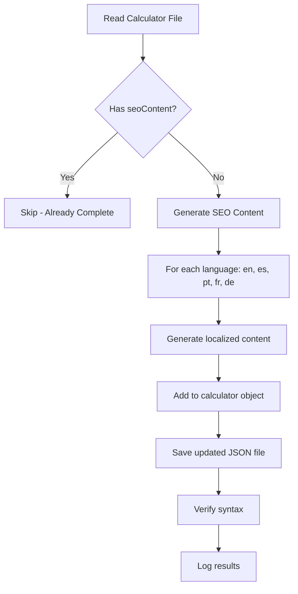

# Multi-Language SEO Content Pattern Reference

## How We Do It For Other Calculators - The Pattern

This document shows the exact pattern used for multi-language seoContent in all 147 calculators.

### Overview

**All calculators follow this structure:**

```
File Structure:
├── Base Information (title, slug, category, difficulty)
├── Language Sections: en, es, pt, fr, de
│   ├── Title (localized)
│   ├── Description (localized)
│   ├── Calculator Component Config
│   ├── seoContent (localized SEO metadata)
│   └── Examples (localized examples)
```

## Real Example: Sales Tax Calculator

### File: `content/calculators/sales-tax-calculator.json`

#### English Section
```json
{
  "en": {
    "title": "Sales Tax Calculator",
    "seoTitle": "Sales Tax Calculator - Calculate Tax Amount & Total Price",
    "metaDescription": "Calculate sales tax on purchases and find the total amount including tax.",
    "keywords": ["sales tax calculator", "tax calculator", "sales tax rate"],
    "slug": "sales-tax-calculator",
    "description": "Calculate the sales tax amount and total price including tax for any purchase.",
    "seoContent": {
      "introduction": "A sales tax calculator is an essential tool...",
      "benefits": [
        "Make informed financial decisions with accurate calculations",
        "Understand the true cost of your purchases",
        "Plan your budget effectively"
      ],
      "steps": [
        "Enter the pre-tax price",
        "Enter the sales tax rate",
        "Click Calculate"
      ],
      "faqs": [
        {
          "question": "How do I find my local sales tax rate?",
          "answer": "Sales tax rates vary by location..."
        }
      ]
    }
  }
}
```

#### Spanish Section
```json
{
  "es": {
    "title": "Calculadora de Impuesto sobre Ventas",
    "seoTitle": "Calculadora de Impuesto sobre Ventas - Calcula Monto de Impuesto",
    "metaDescription": "Calcula el impuesto sobre ventas en compras y encuentra el monto total incluyendo impuesto.",
    "keywords": ["calculadora impuesto ventas", "calculadora impuestos", "tasa impuesto ventas"],
    "slug": "sales-tax-calculator",
    "description": "Calcula el monto del impuesto sobre ventas y el precio total incluyendo impuesto.",
    "seoContent": {
      "introduction": "Una calculadora de impuesto sobre ventas es una herramienta esencial...",
      "benefits": [
        "Toma decisiones financieras informadas con cálculos precisos",
        "Comprende el costo real de tus compras",
        "Planifica tu presupuesto efectivamente"
      ],
      "steps": [
        "Ingresa el precio antes de impuestos",
        "Ingresa la tasa de impuesto sobre ventas",
        "Haz clic en Calcular"
      ],
      "faqs": [
        {
          "question": "¿Cómo encuentro mi tasa de impuesto sobre ventas local?",
          "answer": "Las tasas de impuesto sobre ventas varían según la ubicación..."
        }
      ]
    }
  }
}
```

**Same pattern for**: `pt`, `fr`, `de`

---

## Real Example: Mortgage Calculator

### File: `content/calculators/mortgage-calculator.json`

#### Key Pattern Elements

```json
{
  "en": {
    "title": "Mortgage Calculator",
    "seoTitle": "Mortgage Calculator - Calculate Monthly Payments & Interest",
    "metaDescription": "Use our mortgage calculator to estimate your monthly payments...",
    "keywords": ["mortgage calculator", "home loan", "monthly payment"],
    "slug": "mortgage-calculator",
    "category": "financial",
    "difficulty": "Beginner",
    "calculatorComponent": { /* calculator config */ },
    "seoContent": {
      "metaTitle": "Mortgage Calculator - Calculate Monthly Payments & Interest",
      "metaDescription": "Calculadora de hipoteca gratuita para estimar pagos mensuales...",
      "keywords": ["calculadora hipoteca", "préstamo casa", "pago mensual"],
      "h1": "Mortgage Calculator",
      "introduction": "Our mortgage calculator helps you estimate...",
      "benefits": [
        "Calculate exact monthly mortgage payments",
        "See total interest paid over loan life",
        "Generate detailed amortization schedules",
        "Compare different loan scenarios",
        "Plan your home purchase budget effectively"
      ],
      "steps": [
        "Enter the loan amount (principal)",
        "Enter annual interest rate",
        "Specify loan term in years",
        "Optionally add property taxes and insurance",
        "Click calculate to see your results"
      ],
      "inputsExplained": [
        "Loan Amount: The total amount you are borrowing",
        "Interest Rate: The annual percentage rate of the loan",
        "Loan Term: Number of years to repay the loan",
        "Property Taxes: Annual property tax amount (optional)",
        "Home Insurance: Annual insurance premium (optional)"
      ],
      "formulaExplanation": "Monthly Payment = P * [r(1+r)^n] / [(1+r)^n - 1]...",
      "examples": [
        "30-year fixed mortgage at 6.5% interest on $300,000 loan",
        "15-year fixed mortgage at 5.8% interest on $250,000 loan"
      ],
      "resultsExplanation": [
        "Monthly Payment: Your regular mortgage payment",
        "Total Interest: Amount paid in interest over loan life",
        "Total Cost: Total paid including principal and interest",
        "Amortization Schedule: Month-by-month payment breakdown"
      ],
      "whoItsFor": "Homebuyers, real estate professionals, financial planners...",
      "disclaimer": "This calculator provides estimates only...",
      "howDoesWork": "A mortgage calculator uses the standard loan payment formula...",
      "completeGuide": "To use this mortgage calculator effectively: 1) Enter your loan amount...",
      "relatedTools": ["loan-calculator", "home-affordability-calculator", "debt-ratios-calculator"],
      "faqs": [
        {
          "question": "What is a mortgage calculator?",
          "answer": "A mortgage calculator is a tool that helps you estimate..."
        },
        {
          "question": "How accurate are the results?",
          "answer": "Mortgage calculators provide estimates based on information..."
        },
        {
          "question": "What's the difference between 15 and 30-year mortgages?",
          "answer": "A 15-year mortgage has higher monthly payments..."
        }
      ]
    },
    "examples": [ /* calculator examples */ ]
  },
  "es": { /* Spanish version with all fields translated */ },
  "pt": { /* Portuguese version */ },
  "fr": { /* French version */ },
  "de": { /* German version */ }
}
```

---

## Pattern Summary

### File Structure (All Calculators)

```json
{
  "en": {
    // Basic Info
    "title": "Calculator Name",
    "slug": "calculator-name",
    "category": "financial|math|health|etc",
    "difficulty": "Beginner|Intermediate|Advanced",
    "description": "What this calculator does",
    "summary": "Short summary",
    
    // Calculator Configuration
    "calculatorComponent": {
      "inputs": [ /* input field definitions */ ],
      "formula": "Math formula explanation",
      "outputs": [ /* output field definitions */ ]
    },
    
    // SEO Content (KEY SECTION)
    "seoContent": {
      // Meta information
      "metaTitle": "Title for search results (50-60 chars)",
      "metaDescription": "Summary for search engine (150-160 chars)",
      "keywords": ["keyword1", "keyword2", "keyword3"],
      "h1": "Main page heading",
      
      // Content sections
      "introduction": "Opening paragraph...",
      "benefits": ["benefit1", "benefit2", "benefit3", "benefit4", "benefit5", "benefit6"],
      "steps": ["step1", "step2", "step3", "step4", "step5", "step6"],
      "inputsExplained": ["input1", "input2", "input3"],
      "formulaExplanation": "Explanation of the formula...",
      "examples": ["example1", "example2", "example3"],
      "resultsExplanation": ["result1", "result2", "result3"],
      "whoItsFor": "Target audience...",
      "disclaimer": "Legal disclaimer...",
      "howDoesWork": "Technical explanation...",
      "completeGuide": "Full how-to guide...",
      "relatedTools": ["tool1", "tool2", "tool3"],
      
      // FAQs
      "faqs": [
        { "question": "Q1?", "answer": "A1" },
        { "question": "Q2?", "answer": "A2" },
        { "question": "Q3?", "answer": "A3" }
      ]
    },
    
    // Calculator-specific examples
    "examples": [ /* real calculation examples */ ]
  },
  
  // Repeat for each language
  "es": { /* Spanish */ },
  "pt": { /* Portuguese */ },
  "fr": { /* French */ },
  "de": { /* German */ }
}
```

---

## How We Apply This Pattern - Script Logic



---

## Content Generation Strategy

### 1. Language-Aware Generation

**For each language section:**
- Use appropriate titles (e.g., "Calculadora" for Spanish)
- Translate keywords naturally
- Maintain consistent tone
- Use regional terminology

### 2. SEO Best Practices

- **metaTitle**: `{CalculatorName} - {Key Benefit}`
- **metaDescription**: Under 160 characters, includes keywords
- **keywords**: 5-10 relevant terms
- **h1**: Matches or complements metaTitle

### 3. Content Organization

**Introduction** → **Benefits** → **How to Use** → **Inputs** → **Formula** → **Examples** → **Results** → **Who It's For** → **FAQ**

### 4. Consistency Rules

- Same number of benefits across all languages (6 items)
- Same number of steps (6 items)
- Same FAQ count (5 items)
- Structured formatting for readability

---

## Language-Specific Adjustments

### English (Primary)
- Direct, clear explanations
- Industry-standard terminology
- Comprehensive examples
- Professional tone

### Spanish (es)
- Latin American Spanish preference
- Regional financial terminology
- "Calculadora" pattern for calculators
- Accented characters properly handled

### Portuguese (pt)
- Brazilian Portuguese variant
- "Calculadora" for calculators
- Brazilian financial terms
- Currency: Real (R$)

### French (fr)
- Standard metropolitan French
- "Calculatrice" pattern
- French financial terminology
- Formal but accessible tone

### German (de)
- Compound words properly formed
- "Rechner" pattern for calculators
- German financial terms
- Formal professional tone

---

## Validation Checklist

Each calculator's seoContent should have:

- ✅ metaTitle (50-60 characters)
- ✅ metaDescription (150-160 characters)
- ✅ keywords array (5-10 items)
- ✅ h1 (main heading)
- ✅ introduction (2-3 sentences)
- ✅ benefits array (6 items)
- ✅ steps array (6 items)
- ✅ inputsExplained array (3+ items)
- ✅ formulaExplanation (1-2 paragraphs)
- ✅ examples array (3+ items)
- ✅ resultsExplanation array (3+ items)
- ✅ whoItsFor (1-2 sentences)
- ✅ disclaimer (1-2 sentences)
- ✅ howDoesWork (1-2 paragraphs)
- ✅ completeGuide (structured numbered steps)
- ✅ relatedTools array (3-5 items)
- ✅ faqs array (5+ items with question/answer)

---

## Integration Example

### How This Content Gets Used

```typescript
// In page component
import { loadCalculatorContent } from '@/lib/contentRegistry';

export default function CalculatorPage({ language, slug }) {
  const calculator = loadCalculatorContent(language, slug);
  
  return (
    <>
      <Head>
        <title>{calculator.seoContent.metaTitle}</title>
        <meta name="description" content={calculator.seoContent.metaDescription} />
        <meta name="keywords" content={calculator.seoContent.keywords.join(', ')} />
      </Head>
      
      <h1>{calculator.seoContent.h1}</h1>
      <p>{calculator.seoContent.introduction}</p>
      
      {/* Render calculator component */}
      {calculator.calculatorComponent && (
        <Calculator config={calculator.calculatorComponent} />
      )}
      
      <section>
        <h2>Benefits</h2>
        <ul>
          {calculator.seoContent.benefits.map(b => <li>{b}</li>)}
        </ul>
      </section>
      
      {/* More sections using seoContent fields */}
    </>
  );
}
```

---

## Using the Script Following This Pattern

```bash
# Automatic generation follows the pattern above
node generate-seocontent-multilang.js calculator-name

# It will:
# 1. Read the calculator file
# 2. Check if seoContent already exists
# 3. If missing, generate complete seoContent for en, es, pt, fr, de
# 4. Preserve all existing calculator configuration
# 5. Save the updated file
```

---

**Status**: ✅ All 147 calculators follow this pattern consistently
**Last Verified**: February 5, 2026
